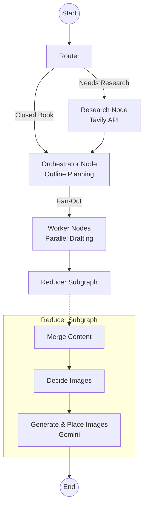

# InkFlow

**An intelligent, multi-agent system for automating the research, planning, and drafting of high-quality technical blog posts.**

InkFlow is an autonomous content creation pipeline built with **LangGraph** and **Streamlit**. It takes a simple topic prompt and orchestrates a team of specialized AI agents to research the web, structure an outline, write individual sections, and even generate relevant diagrams and images—outputting a fully formatted, ready-to-publish Markdown bundle.

---

## 🌊 Agent Workflow



---
## ✨ Key Features

- **Intelligent Routing:** Automatically determines if a prompt requires live web research ("open-book"), can use internal knowledge ("closed-book"), or needs a hybrid approach.
- **Automated Web Research:** Integrates with the **Tavily Search API** to gather up-to-date, authoritative evidence and citations, ensuring technical accuracy and recency.
- **Strategic Orchestration:** Generates structured, multi-section outlines tailored to specific audiences, tones, and constraints (e.g., explainer, tutorial, news roundup).
- **Parallel Drafting (Fan-out/Fan-in):** Spawns concurrent worker agents to draft individual sections, strictly adhering to word counts, bullets, and provided research evidence.
- **Automated Visuals:** Analyzes the final text to intelligently propose and generate contextual diagrams or images using **Google Gemini**, automatically embedding them into the Markdown.
- **Interactive Frontend:** A rich **Streamlit** user interface that provides real-time progress streaming, evidence inspection, image previews, and one-click ZIP bundle downloads.

## 🏗️ Architecture

InkFlow is designed as a stateful graph using LangGraph, consisting of the following nodes:

1. **Router:** Analyzes the prompt and determines the research mode and recency requirements.
2. **Research (Optional):** Fetches relevant articles and snippets using Tavily.
3. **Orchestrator:** Formulates a comprehensive `Plan` containing multiple targeted `Tasks`.
4. **Workers:** A fan-out layer where individual agents write specific sections in parallel.
5. **Reducer Subgraph:** 
   - Merges all sections into a cohesive document.
   - Decides where visuals would improve comprehension.
   - Generates and places images into the final Markdown.

## 🛠️ Technology Stack

- **Core Framework:** [LangGraph](https://langchain-ai.github.io/langgraph/) / [LangChain](https://python.langchain.com/)
- **Frontend:** [Streamlit](https://streamlit.io/)
- **Language Models:** OpenAI (`gpt-4-turbo` / `gpt-4o-mini`)
- **Image Generation:** Google GenAI (`gemini-2.5-flash-image`)
- **Search Engine:** Tavily API

## 🚀 Getting Started

### Prerequisites

Ensure you have Python 3.9+ installed. You will also need API keys for OpenAI, Tavily, and Google Gemini.

### Installation

1. **Clone the repository:**
   ```bash
   git clone https://github.com/Anshuman-Jha/InkFlow.git
   cd InkFlow
   ```

2. **Set up a virtual environment:**
   ```bash
   python3 -m venv venv
   source venv/bin/activate
   ```

3. **Install dependencies:**
   ```bash
   pip install streamlit langchain-openai langgraph pydantic python-dotenv google-genai langchain-community tavily-python pandas
   ```

4. **Configure Environment Variables:**
   Create a `.env` file in the root directory and add your API keys:
   ```env
   OPENAI_API_KEY=your_openai_api_key
   TAVILY_API_KEY=your_tavily_api_key
   GOOGLE_API_KEY=your_google_api_key
   ```

### Running the Application

Start the Streamlit frontend. The backend LangGraph application is integrated directly into the Streamlit process.

```bash
streamlit run bwa_frontend.py
```

Navigate to `http://localhost:8501` in your browser to start generating blogs.

---
*Built with modern AI workflows in mind.*
